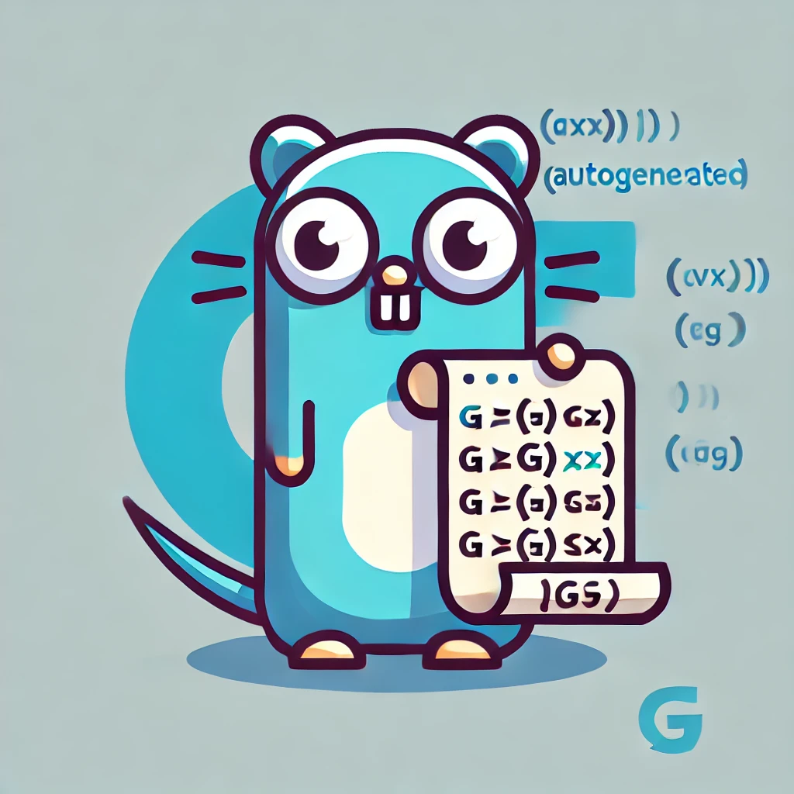

# enumgen

{ width=20% }

enumgen is a tool for generating enum-like functionalities in golang language.
It automatically detects all values of define type and provides methods like:
* String
* MarshalJSON
* UnmarshalJSON
* Values
* IsValid

## CLI usage

``` bash
enumgen <constant type name> <input file path> <output file path>
```

## Limitations

1. Generates all the methods defined in template.
2. Generates method with the same package name as the input file.